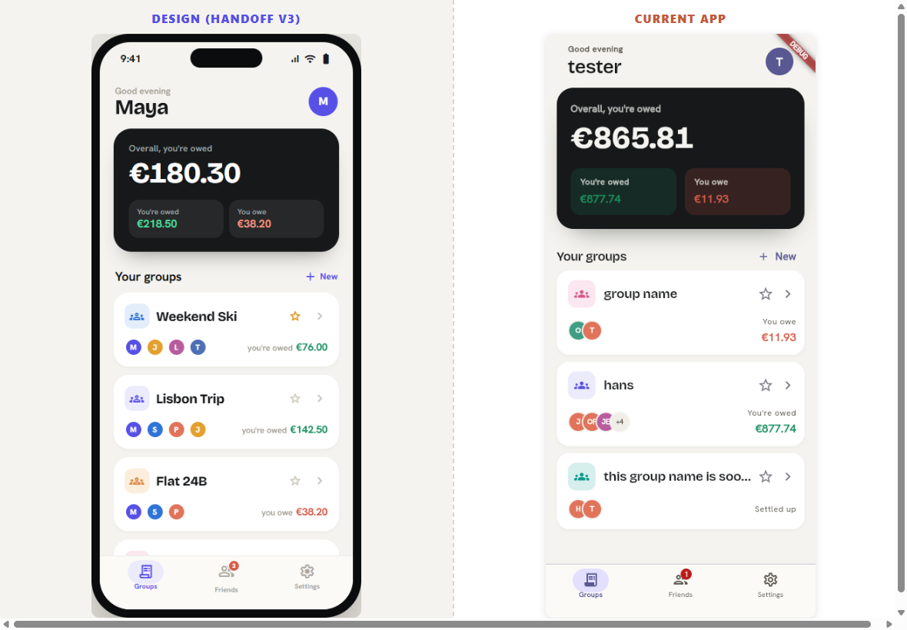
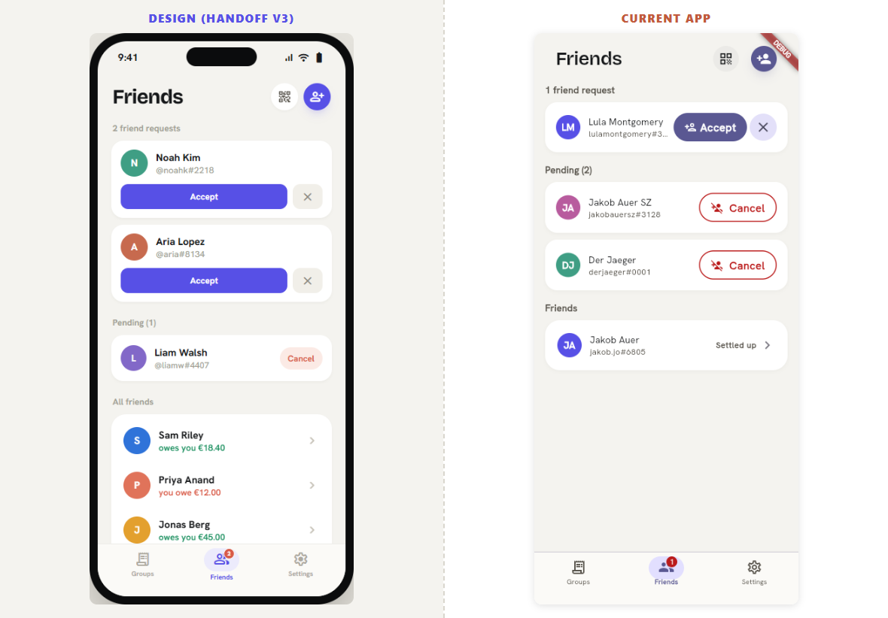
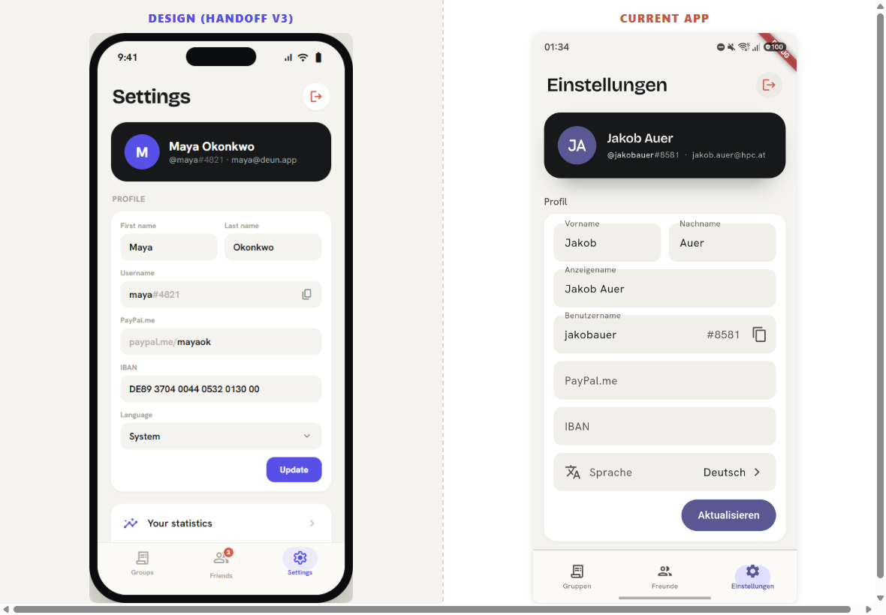
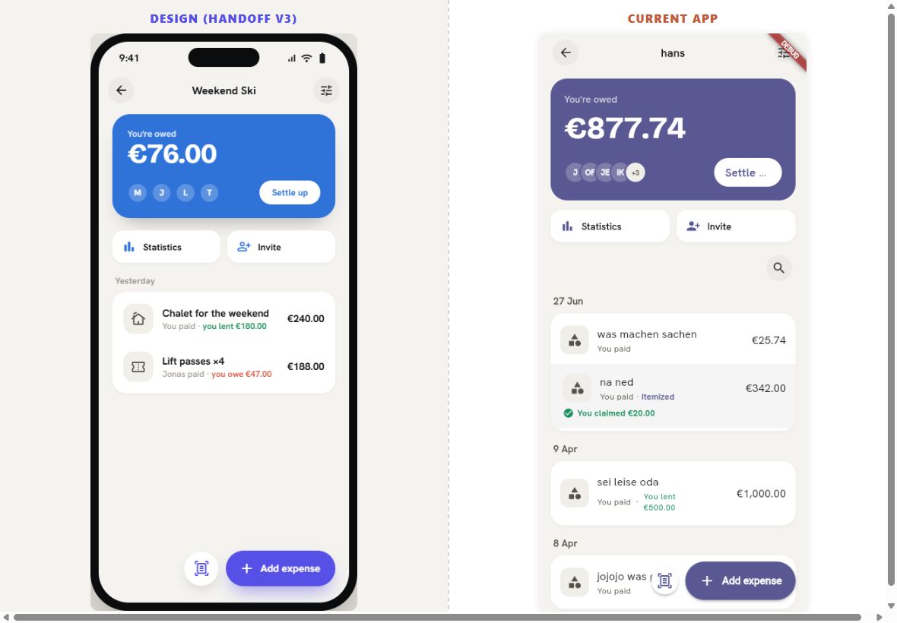
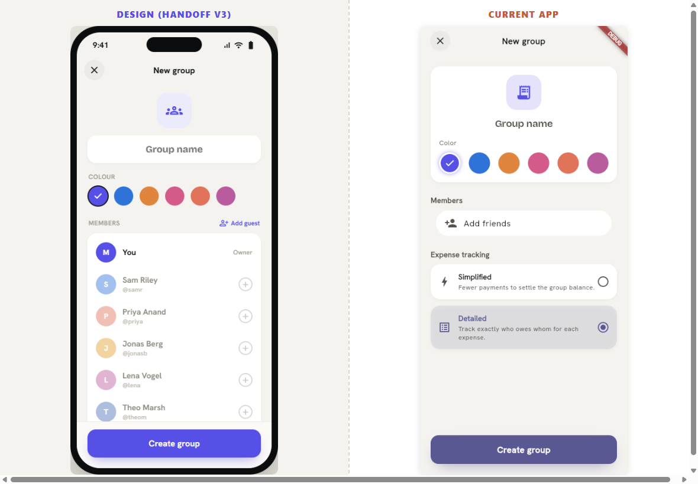
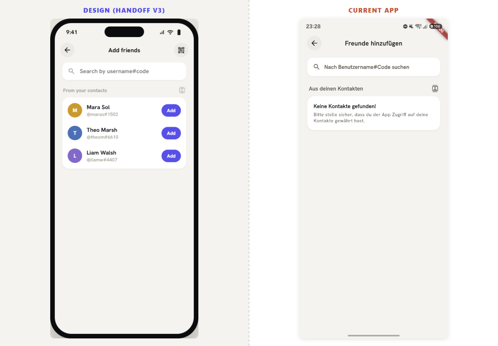
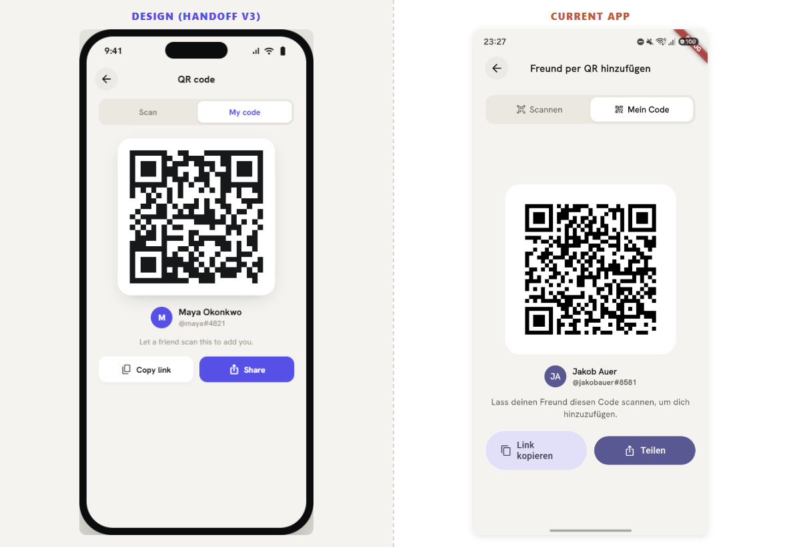
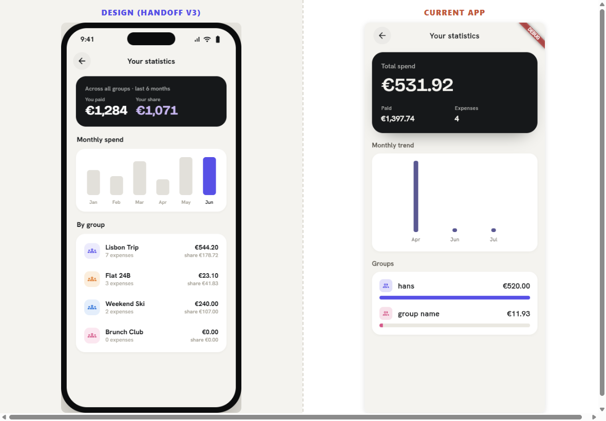

# Design Audit — Handoff v3 vs. current app

Side-by-side captures of the **design handoff (v3 prototype)** against the **current on-device app**, so the
remaining fidelity gaps are easy to see and hand back as a fix loop.

- **Design** = `Deun Redesign v2.dc.html` prototype, rendered in a browser (light mode).
- **Current app** = live build on physical device `R5CY22DR0FK` (`app.deun.www`), branch `feat/v3-motion-foundation`.

> **Automating this:** [`../superpowers/AUDIT_LOOP.md`](../superpowers/AUDIT_LOOP.md) drives the
> FIX → AUDIT → STOP loop over this checklist. Capture harness: [`tools/`](tools/capture.md).

## Folder layout
```
design_audit/
├── design/      15 prototype screenshots (full screen set)
├── app/          8 live on-device screenshots
├── compare/      8 side-by-side composites (design | app) ← look here first
├── tools/       capture harness (serve.js + capture.md)
└── _build.html  layout used to regenerate composites (served + screenshot via Playwright)
```

To regenerate a composite: serve this folder over HTTP and screenshot
`_build.html?p=<key>` at 1180×820, where `<key>` is one of the pair keys in `_build.html`.

## Coverage
| # | Screen | Composite | App capture |
|---|--------|-----------|-------------|
| 1 | Groups home | [compare_groups](compare/compare_groups.png) | ✅ |
| 2 | Friends | [compare_friends](compare/compare_friends.png) | ✅ |
| 3 | Settings / Profile | [compare_settings](compare/compare_settings.png) | ✅ |
| 4 | Group detail | [compare_group_detail](compare/compare_group_detail.png) | ✅ (hans) |
| 5 | New / Edit group | [compare_group_form](compare/compare_group_form.png) | ✅ |
| 6 | Add friend | [compare_add_friend](compare/compare_add_friend.png) | ✅ |
| 7 | QR code | [compare_qr](compare/compare_qr.png) | ✅ |
| 8 | Personal statistics | [compare_personal_stats](compare/compare_personal_stats.png) | ✅ (empty data) |
| 9 | Expense detail | — | ⏳ design only |
| 10 | Expense editor (quick) | — | ⏳ design only |
| 11 | Expense editor (itemized) | — | ⏳ design only |
| 12 | Settle up | — | ⏳ design only |
| 13 | Group statistics | — | ⏳ design only |
| 14 | Invite group | — | ⏳ design only |
| 15 | **Tap to Claim** | — | ⏳ design only |

⏳ = design reference captured (`design/`), live-app shot pending — these sit behind in-group expense navigation,
which is flaky to drive over `adb` on this build (the group ledger is a live list and taps race with realtime
rebuilds). Re-shoot them while working on each screen.

---

## How to use this for the next loop
Each item below is a discrete, checkable delta. Same rules as `../design_handoff/ISSUES.md` (theme/`SemanticColors`
not hard hex; copy via `AppLocalizations` en+de; light **and** dark). Several are theme-level and propagate
(bottom nav, section labels, buttons, input fields).

**Severity:** 🔥 high (wrong / unusable) · ⚠️ medium (clearly off) · 💅 low (cosmetic).
Open problem = `- [ ]` with a severity tag; done = `- [x] … ✅ <SHA>`. New items the AUDIT
adds use: `- [ ] <id> · <screen> · <delta> 🔥|⚠️|💅 — <file:loc> — target: <value> — ev: compare/<x>.png`.

---

## 1 · Groups home  ·  `pages/groups/presentation/group_list.dart`


> ℹ️ These items were captured against the **v2** prototype. The loop's first AUDIT re-baselines
> every design screen against **v3** (`design_handoff_updated`) and revises/adds items accordingly.

- [ ] **1.1 Greeting is one big line.** ⚠️ App shows `Hi, Jakob Auer` as a single bold line. Design = a small
  muted time-of-day label (`Good evening`) **above** a large bold **first name** (`Maya`). Two lines, two weights.
- [ ] **1.2 "Your groups" heading not bold.** 💅 Design heading is bold (≈700). App renders it light/regular.
- [ ] **1.3 Group-row icon is a receipt glyph.** ⚠️ Design uses the rounded **people / `groups`** icon inside a
  color-tinted rounded square (tinted by group color). App shows a receipt icon.
- [ ] **1.4 Hero balance block differs** 🔥 (the "you're owed" issues):
  - [ ] **1.4a Amount colour:** 🔥 big balance is **green** in app → should be **white** (`€180.30` is white in design).
  - [ ] **1.4b Label:** 💅 app `You're owed` → design `Overall, you're owed`.
  - [ ] **1.4c Chip labels:** ⚠️ app chips read `Owed` / `Owe`; design chips read **`You're owed`** (green value)
    and **`You owe`** (coral value).
- [ ] **1.5 Bottom nav styling.** ⚠️ App active tab sits in an indigo pill on a heavier bar (thick top border,
  off-tone surface). Design = flat bar, no pill highlight, thin/no divider, active tab is just colour. *(Theme-level.)*
- [ ] **1.6 Floating "+ New group" FAB still present.** ⚠️ Design has **no** bottom FAB here — group creation is the
  **`+ New` indigo text-link** in the "Your groups" section header.
- [ ] **1.7 (debug) Red ad-failure banner** 💅 renders in the list. Per your note, leaving it — but it also overlaps
  the ledger and makes in-list taps flaky.

## 2 · Friends  ·  `pages/friends/presentation/friend_list.dart`


- [ ] **2.1 List is chunky separated cards.** 🔥 App = full-width white cards with large vertical gaps, status as a
  filled **pill badge**, no chevron. Design = a **tight grouped list**: one container, thin row dividers, small
  avatar, name + handle, **plain coloured status text** (`owes you €…` / `you owe €…` / `all settled up`), and a
  trailing **chevron**. Main "spacing looks completely different" point.
- [ ] **2.2 Section header copy.** ⚠️ App label `Friends` → design `All friends`. Design also stacks
  **`N friend requests`** (accept/✕ cards) and **`Pending (N)`** (cancel) sections above the list.
- [ ] **2.3 Header action icons.** 💅 Design = two circular icon buttons (outlined **QR** + **filled indigo
  person-add**). App shows bare icons.

## 3 · Settings / Profile  ·  `pages/settings/setting.dart`


- [ ] **3.1 No identity header.** ⚠️ App opens straight into the profile form. Design opens with a **`Settings`
  title + avatar/identity block** (`Maya Okonkwo · @maya#4821 · email`) above the form.
- [ ] **3.2 Fields carry leading icons.** ⚠️ App fields have a leading icon (badge/@/card/bank). Design fields are
  clean filled fields with **inline labels** (First/Last name as a 2-column row), no leading icon. (`ISSUES.md` I-3c)
- [ ] **3.3 Section labels not uppercase/tracked.** 💅 `Preferences` etc. should be 12px/700, tracked, UPPERCASE,
  muted. (`ISSUES.md` I-3d)
- [ ] **3.4 `Update` button is an M3 stadium pill** ⚠️ → design = 15px rounded-rect, weight 700. (`ISSUES.md` I-3a, theme-level)

## 4 · Group detail  ·  `pages/groups/presentation/group_detail.dart`

> App = live **hans** group; design = **Weekend Ski**. Hero colour differs because it is tinted by group colour —
> compare structure/treatment, not the hue.

- [ ] **4.1 Hero action row overflows** 🔥 — the yellow/black overflow stripe is visible on the app hero's right edge
  (avatars + Settle). This is **`ISSUES.md` I-1** confirmed live.
- [ ] **4.2 Statistics / Invite** ⚠️ render as outlined pill buttons in app; design = two flat white cards with icon+label.
- [ ] **4.3 Settle button** 💅 is an M3 stadium pill; design uses a white rounded pill on the hero (OK-ish) but verify radius/weight.
- [ ] **4.4 Ledger rows** ⚠️ differ from the design's expense rows (icon tile + title + "you paid/lent" + amount);
  re-check against design once styled. Per-row claim affordances (`claimed`, claim icon) need the design treatment.

## 5 · New / Edit group  ·  `pages/groups/presentation/group_detail_edit.dart`


- [ ] **5.1 Title field.** ⚠️ App = `Add title` with a leading icon tile. Design = inline `Group name` text field with
  a leading `groups` glyph, no heavy tile.
- [ ] **5.2 Color picker.** 💅 Swatch row close, but check selected-state ring/check and the exact 6-swatch palette.
- [ ] **5.3 Members.** ⚠️ App = a single `Add friends` field. Design = `Add guest` action **plus an inline list of
  addable friends** (You/Owner + each friend with an `add`), so members are added without leaving the form.
- [ ] **5.4 Tracking mode cards.** 💅 App "Detailed" selected state uses a filled grey card; design uses radio rows
  (`Simplified` / `Detailed`) with copy "Fewest payments to settle up." / "Track every debt one-to-one."
- [ ] **5.5 `Create` button** ⚠️ stadium pill → design rounded-rect. (`ISSUES.md` I-3a)

## 6 · Add friend  ·  `pages/friends/presentation/friend_add_page.dart`


- [ ] **6.1 Structure matches well** 💅 (circular back, search field, "From your contacts"). Mainly token polish.
- [ ] **6.2 Empty-state typo:** ⚠️ "Please make **shure**…" → "sure". (en + de l10n)
- [ ] **6.3 Search field / contact rows** 💅 — apply the design's filled-field + row treatment; design shows result
  rows with avatar + name + handle + indigo `Add`.

## 7 · QR code  ·  `pages/friends/presentation/friend_qr_page.dart`


- [ ] **7.1 Title copy.** 💅 App `Add Friend via QR` → design `QR code`.
- [ ] **7.2 Segmented control** 💅 (Scan / My code) close; align labels (`My Code` vs `My code`) and the segmented style.
- [ ] **7.3 `Share` button** ⚠️ is a stadium pill → design rounded-rect; `Copy link` secondary style. (`ISSUES.md` I-3a)

## 8 · Personal statistics  ·  `pages/statistics/personal_statistics_page.dart`

> App body shows **"No expenses"** for this account/range (data didn't populate), so only the header + range control
> are comparable. Re-shoot on an account with personal spend.

- [ ] **8.1 Title copy.** 💅 App `Your Spending` → design `Personal stats`-style header (verify intended title).
- [ ] **8.2 Range control.** 💅 App `3M/6M/12M/All` segmented matches design's range chips — check selected style/tokens.
- [ ] **8.3 Body (when populated)** ⚠️ should match the design's stats layout: total-spend card with trend %, avg/expenses/
  biggest tiles, monthly trend bars, member breakdown, "Where it went" category rows (same as Group statistics).

---

## Design-only references (live-app capture pending)
Captured in `design/` for the next loop — open the PNG directly. App shots blocked by in-group navigation flakiness.

- **Expense detail** — `design/design_06_expense_detail.png` (header del/edit, summary card, "Split equally" rows).
- **Expense editor · quick** — `design/design_07_expense_editor.png` (Quick split / Itemized tabs, amount, Paid by /
  When rows, Equal/Shares/%/Exact segmented, per-member rows).
- **Expense editor · itemized** — `design/design_08_expense_itemized.png` (Total · from N items, Scan, item rows with
  qty steppers, "Add & share for claiming").
- **Settle up** — `design/design_09_settle_up.png` ("You're owed overall", per-person owe rows + Remind).
- **Group statistics** — `design/design_10_group_stats.png` (range tabs, total-spend + trend, monthly bars, members,
  "Where it went").
- **Invite group** — `design/design_11_invite.png` (bottom sheet: join link, QR / Share link).
- **Tap to Claim** — `design/design_12_claim.png` (**the one new feature**: "Preview as" persona row, dark summary
  with progress bar + per-member chips, per-unit item rows with `take one` / `Split one`, unclaimed warning).

## Source captures
`design/design_01..15_*.png` and `app/app_*.png` are the raw single-screen shots behind the composites.
